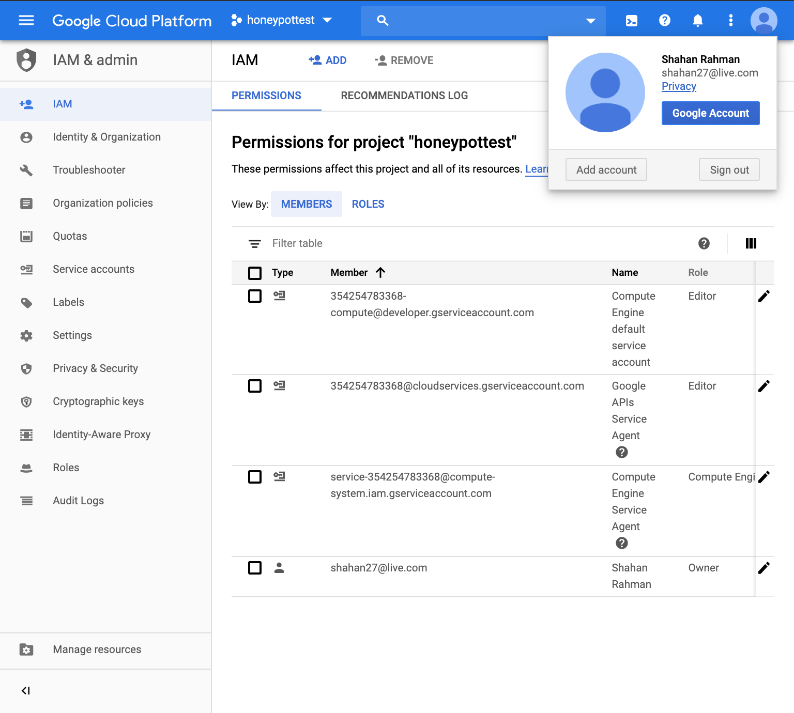
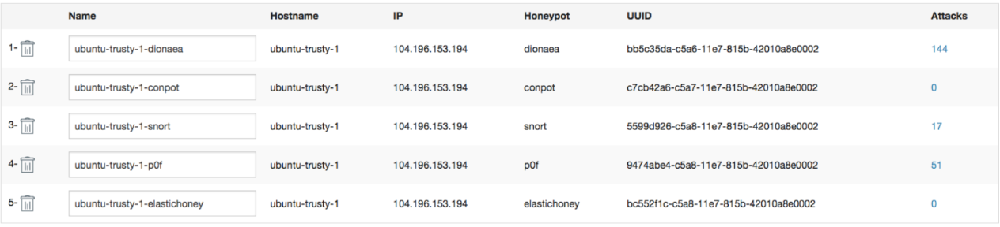

# Weeks10-11Project-Honeypot

Which Honeypot(s) you deployed

Any issues you encountered

A summary of the data collected: number of attacks, number of malware samples, etc.

Any unresolved questions raised by the data collected

